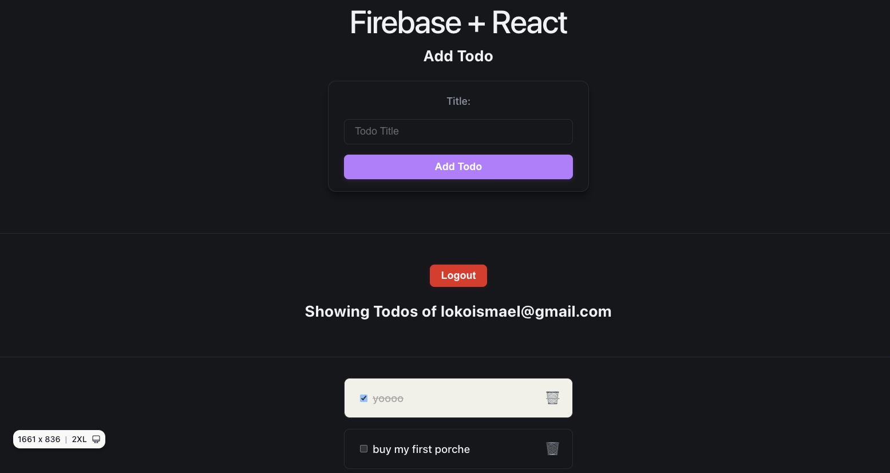

# Firebase Authentication and Firestore Database with React

This project demonstrates how to implement user authentication and data management using Firebase Authentication and Firestore Database in a React application. It allows users to sign up, log in, and manage their to-do lists securely.

## Features

- User Authentication: Sign up, log in, and log out functionality using Firebase Authentication.
- Firestore Database: Store and manage to-do items in Firestore, allowing users to create
  , read, update, and delete their tasks.

